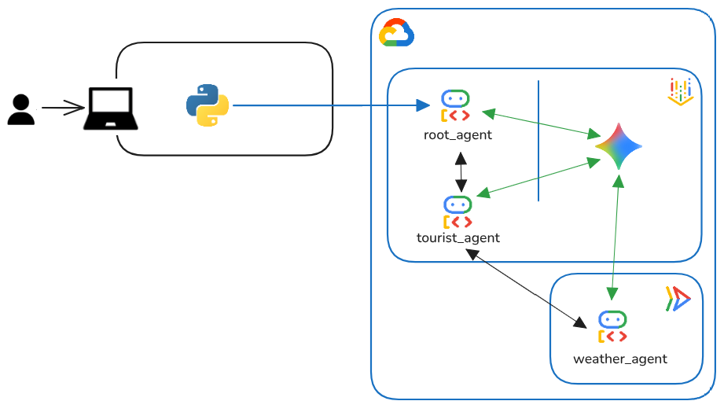

# SKILLS

Simple ReAct agent
Agent generated with `agents-cli` version `0.1.2`

## Architecture



## Project Structure

```
agent-cli-hackathon/
├── app/         # Core agent code
│   ├── agent.py               # Main agent logic
│   ├── agent_runtime_app.py    # Agent Runtime application logic
│   └── app_utils/             # App utilities and helpers
├── mcp/         # Model Context Protocol (Weather Tool)
│   ├── app/                   # MCP server application code
│   └── deploy/                # Deployment scripts
├── skills/      # Dynamic agent skills (Persona & Tone)
│   └── tourist_concierge/     # Example skill definition
├── tests/                     # Unit, integration, and load tests
├── GEMINI.md                  # AI-assisted development guide
└── pyproject.toml             # Project dependencies
```

> 💡 **Tip:** Use [Gemini CLI](https://github.com/google-gemini/gemini-cli) for AI-assisted development - project context is pre-configured in `GEMINI.md`.

## Requirements

Before you begin, ensure you have:
- **uv**: Python package manager (used for all dependency management in this project) - [Install](https://docs.astral.sh/uv/getting-started/installation/) ([add packages](https://docs.astral.sh/uv/concepts/dependencies/) with `uv add <package>`)
- **agents-cli**: Agents CLI - Install with `uv tool install google-agents-cli`
- **Google Cloud SDK**: For GCP services - [Install](https://cloud.google.com/sdk/docs/install)


## Quick Start

Install required packages:

```bash
agents-cli install
```

Test the agent with a local web server:

```bash
adk web --allow_origins "*"
```

## Memory & Persistence

This agent implements a hybrid memory strategy to provide a personalized, "memory-aware" experience across sessions.

### 1. User-Persistent State (Session Service)
Used for structured, deterministic data that must be strictly maintained.
- **Implementation**: Captures city names via `before_tool_callback` and stores them in `user:visited_cities`.
- **Storage**: Agent Engine persists keys with the `user:` prefix across all sessions for the same `user_id`.
- **Retrieval**: Uses **Dynamic State Injection** (`{user:visited_cities}`) in the system instruction. This is high-reliability and low-latency.

### 2. Memory Bank (Long-term Knowledge)
Used for semantic facts, insights, and observability in the Agent Registry.
- **Implementation**: Uses `after_agent_callback` to trigger `callback_context.add_session_to_memory()`.
- **Storage**: Generates natural language **Memory objects** (embeddings) stored in the managed Memory Bank.
- **Retrieval**: Uses the `PreloadMemoryTool` to automatically find and inject relevant past facts into the conversation context.

## Skills Management

The agent uses a dynamic skill-based architecture to manage persona, tone, and domain-specific knowledge.

### Dynamic Skill Loading
Skills are decoupled from the core agent logic and loaded dynamically from the `skills/` directory.
- **Implementation**: `SkillManager` scans the directory for `SKILL.md` files and indexes them.
- **Toolset**: `SkillToolset` provides these skills as tools to the agents, allowing them to adapt their behavior based on the triggered skill.
- **Benefits**: This allows for easy extension of agent capabilities and consistent persona enforcement without modifying the main agent code.

### Core Skills
- **Tourist Concierge**: Located in `skills/tourist_concierge/`, this skill provides sophisticated travel recommendations and ensures a professional concierge tone throughout the interaction.

---

## Commands

| Command              | Description                                                                                 |
| -------------------- | ------------------------------------------------------------------------------------------- |
| `agents-cli install` | Install dependencies using uv                                                         |
| `agents-cli playground` | Launch local development environment                                                  |
| `agents-cli lint`    | Run code quality checks                                                               |
| `uv run pytest tests/unit tests/integration` | Run unit and integration tests                                                        |
| `agents-cli deploy`  | Deploy agent to Agent Runtime                                                                |
| `agents-cli publish gemini-enterprise` | Register deployed agent to Gemini Enterprise                    |

## 🌐 Model Context Protocol (MCP) Server

This project includes a Weather MCP Server that exposes a `get_weather` tool. It wraps an ADK agent that uses Google Maps and Weather APIs to provide accurate weather information for any city.

### MCP Deployment

The MCP server is designed to be deployed to Cloud Run using the provided script.

1.  **Configure Secret**: Ensure you have a Google Maps/Weather API key stored in Google Cloud Secret Manager named `weather-api-key`.
2.  **Deploy**:
    ```bash
    chmod +x mcp/deploy/deploy.sh
    ./mcp/deploy/deploy.sh
    ```

The script will:
- Build the container image using Cloud Build.
- Deploy the service to Cloud Run.
- Grant necessary permissions and set up secret environment variables.
- Update `mcp/.env` with the deployment URL.

## 🛠️ Project Management

| Command | What It Does |
|---------|--------------|
| `agents-cli scaffold enhance` | Add CI/CD pipelines and Terraform infrastructure |
| `agents-cli infra cicd` | One-command setup of entire CI/CD pipeline + infrastructure |
| `agents-cli scaffold upgrade` | Auto-upgrade to latest version while preserving customizations |

---

## Development

Edit your agent logic in `app/agent.py` and test with `agents-cli playground` - it auto-reloads on save.

## Deployment

```bash
gcloud config set project <your-project-id>
agents-cli deploy
```

To add CI/CD and Terraform, run `agents-cli scaffold enhance`.
To set up your production infrastructure, run `agents-cli infra cicd`.

## Observability

Built-in telemetry exports to Cloud Trace, BigQuery, and Cloud Logging.
